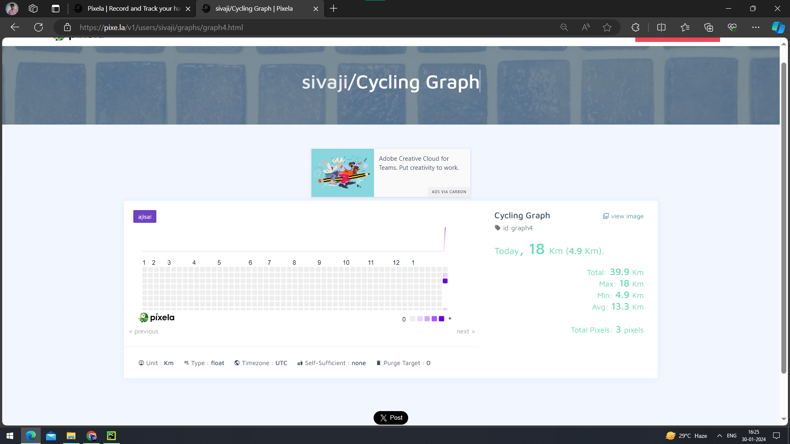
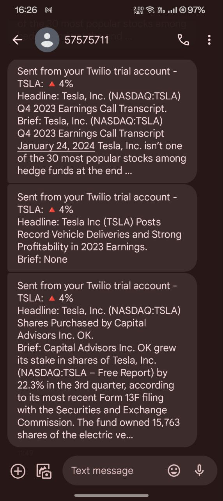

# Project 1: Pixela - Daily Cycling Tracker

## Introduction
This project uses the Pixela API to track daily cycling activities. Users can create an account, define a graph, post values to the graph, update values, and even delete entries. The goal is to help users visualize and monitor their cycling progress over time.

## screenshot


## Setup
1. Install required libraries:
    ```bash
    pip install requests
    ```

2. Replace the placeholders in the script:
    - Replace `USERNAME` and `TOKEN` with your Pixela account information.
    - Adjust the graph parameters such as `id`, `name`, `unit`, `timezone`, and `color`.
    - Customize the `GRAPH_ID` variable to match the desired graph.

## Usage
1. **Create User Account:**
    Uncomment and run the code block responsible for creating a user account. Check the response for success.

2. **Create Graph:**
    Uncomment and run the code block responsible for creating a graph. Ensure the graph is successfully created.

3. **Post Value to Graph:**
    Run the code block to post daily cycling data. Enter the kilometers cycled when prompted.

4. **Update Graph Value:**
    Uncomment and run the code block to update a specific date's cycling data.

5. **Delete Graph Value:**
    Uncomment and run the code block to delete a specific date's entry.

## Notes
- The provided script is a simplified version. Ensure to check Pixela API documentation for more advanced features.

---

# Project 2: Stock Price and News Tracker

## Introduction
This project fetches daily stock prices using the Alpha Vantage API and checks for significant percentage changes. If there's a notable change, it fetches related news articles.

## screenshot

<p align="center">
  
</p>
## Setup
1. Install required libraries:
    ```bash
    pip install requests twilio
    ```

2. Replace the placeholders in the script:
    - Replace `STOCK_NAME`, `COMPANY_NAME`, `STOCK_API_KEY`, `NEWS_API_KEY`, `ACCOUNT_SID`, `TWILIO_AUTH_TOKEN`, `TWILIO_NUMBER`, and `MY_NUMBER` with your respective API keys and phone numbers.

## Usage
1. Run the script to fetch daily stock prices and calculate percentage changes.
2. If the percentage change is greater than a specified threshold, fetch news articles related to the company.
3. Send the first 3 articles as separate messages via Twilio to the specified phone number.

## Notes
- The script uses the Alpha Vantage API for stock data and the News API for fetching news articles.
- Twilio is used to send SMS messages with news articles.

